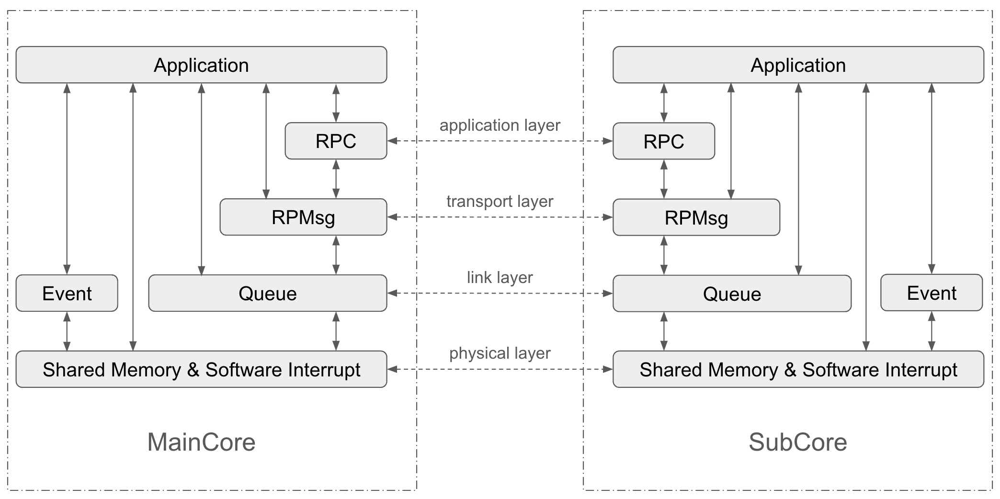

# ESP-AMP

## Introduction

ESP-AMP is an open source framework for building Asymmetric Multiprocessing (AMP) applications on ESP32 series Sytem-on-a-Chips (SoC) with multiple processing cores. With one core running IDF FreeRTOS firmware, ESP-AMP facilitates another core to run a different software environment, such as bare-metal or any other RTOS environment. ESP-AMP provides a set of APIs for inter-core communication and synchronization. In the rest of the README, We refer to the core running IDF FreeRTOS as maincore, and the core running other software environment as subcore.

Compared to the default Symmetric Multiprocessing (SMP) system offered by ESP-IDF, ESP-AMP has the following differentiation:
- Choice of Cores for specific functionality: In SoCs with single High-Performance (HP) core, Low-Power (LP) Core can be used as subcore to offload some tasks from the maincore. In a system with multiple HP Cores, ESP-AMP can work in a mode where one HP core is used as a maincore and other used as a subcore
- Flexibility: ESP-AMP allows you to deploy different configurations and run dedicated applications in parallel on two cores to fit more complicated use cases. At present, only bare-metal is supported on subcore.


## Architecture

ESP-AMP offers a comprehensive set of components for inter-core communication (IPC) and synchronization, organized in a layered architecture as illustrated in the figure below.



You can choose APIs from different layers or combine APIs from various layers to meet specific requirements or particular use cases. From bottom to top, these components are:

* Shared Memory: foundamental data sharing mechanism for cross-core communication. Refer to [Shared Memory Doc](./docs/shared_memory.md) for more details.
* Software Interrupt: basic notification mechanism for cross-core communication. Refer to [Software Interrupt Doc](./docs/software_interrupt.md) for more details.
* Event: containing APIs for synchronization between maincore and subcore. Refer to [Event Doc](./docs/event.md) for more details.
* Queue: a lockless queue which enables uni-directional core-to-core communication. Refer to [Queue Doc](./docs/queue.md) for more details.
* RPMsg: an implementation of Remote Processor Messaging (RPMsg) protocol that enables concurrent communication streams in application. Refer to [RPMsg Doc](./docs/rpmsg.md) for more details.
* RPC: a simple RPC framework built on top of RPMsg. Refer to [RPC Doc](./docs/rpc.md) for more details.

Besides these, ESP-AMP also creates a port layer to abstract the difference between various environment and SoCs, offering a unified interface for upper layers. Refer to [Port Layer Doc](./docs/port.md) for more details.

## Build System

ESP-AMP comes with a flexible build system that can easily build firmware for both the maincore and the subcore. The build system features:

* Standard ESP-IDF build system to build maincore firmware.
* Two modes for building subcore firmware: unified build mode to build both the subcore and main core firmware with a single command, and separate build mode to build subcore firmware separately.
* Two subcore firmware storage options: either embedding subcore firmware into maincore firmware or writing it to a flash partition.
* Dedicated toolchain settings for building subcore in bare-metal environment.

Please check [Build System Doc](./docs/build_system.md) for more details.

## System Component

System component contains APIs for maincore to manage life cycle of subcore and process system events from subcore. Supported features at present include:

* Start subcore and stop subcore.
* Load subcore firmware to DRAM or RTC RAM.
* Notify maincore about subcore panic event and invoke customizable panic handler.
* Route subcore printf messages to maincore console.

Please check [System Doc](./docs/system.md) for more details.

## Supported ESP-IDF Version and SoCs

IDF v5.3.1 or later is required. At present the following maincore-subcore configurations are supported:

| SoC | Maincore | Subcore |
| :--- | :--- | :--- |
| ESP32-C6 | HP core | LP core |
| ESP32-P4 | HP core | HP core |

Please note that we are working to support more SoCs with additional maincore-subcore configurations.

## Getting Started

For quick start, follow the steps below to build and run examples.

First, setup the IDF environment. 

``` shell
git clone --recursive https://github.com/espressif/esp-idf.git
cd esp-idf
git checkout v5.3.1
./install.sh
. export.sh
```

For more details on building IDF projects, please refer to [IDF Programming Guide](https://docs.espressif.com/projects/esp-idf/en/latest/esp32/get-started/index.html)

Second, clone this repository.
``` shell
git clone https://github.com/espressif/esp-amp.git
```

Now you are ready to build examples.

``` shell
cd esp-amp/examples/<example>
idf.py set-target <target>
idf.py build
idf.py flash monitor
```

## Tips for developing subcore firmware

The following tips work for both ESP32-P4 and ESP32-C6:

* Dynamic memory allocation is supported but not enabled by default. To enable it, set `CONFIG_ESP_AMP_SUBCORE_ENABLE_HEAP=y`. Heap size can be configured via `CONFIG_ESP_AMP_SUBCORE_HEAP_SIZE`.
* Reserve enough stack space. Stack is allocated from LP RAM on ESP32-C6 and HP RAM on ESP32-P4. Stack smashing protection mechanism is not supported on subcore. As stack grows, it may overwrite heap or `.bss` section without any warning and cause unpredictable results. Therefore, it is recommended to reserve enough stack space for subcore application. Sdkconfig option `ESP_AMP_SUBCORE_STACK_SIZE_MIN` can be used to specify the minimum stack size. If the remaining memory space is insufficient to allocate the stack, the build will fail.

If you are developing subcore firmware on ESP32-C6, please refer to the following tips:

* Go beyond the limited RTC Memory: By default, subcore firmware is loaded into RTC memory if subcore type is LP core. However, the limited size of RTC RAM (16KB on ESP32-C6) can quickly go short as LP core firmware grows. ESP-AMP allows you to load subcore firmware into HP RAM by setting Kconfig option `CONFIG_ESP_AMP_SUBCORE_USE_HP_MEM=y`. Please refer to [Memory Layout Doc](./docs/memory_layout.md) for more details.
* Keep away from HP ROM APIs: LP core has no access to HP ROM. Therefore, ROM apis such as `esp_rom_printf`, `esp_rom_delay_us` are not supported on LP core.

## Known Limitations

ESP-AMP is still under active development. The following limitations exist at present:

### ESP32-P4 Related

* Subcore Type: At present only HP core is supported as subcore on ESP32-P4. LP core is not yet supported.
* Missing support for XIP and PSRAM: Cache is not enabled on subcore at present. As a consequence, accessing data from PSRAM and execution in Place (XIP) from flash are not supported.
* Limited Cache Size on ESP32-P4 Maincore: ESP32-P4 SoC encapsulates 768 KB Internal L2MEM, from which cache memory is allocated. Users can configure 128KB, 256KB or 512KB as cache memory via sdkconfig `CONFIG_CACHE_L2_CACHE_SIZE`. However, due to the 256KB reserved L2MEM for subcore firmware, the maximum size of cache memory with ESP-AMP enabled is reduced to 256KB.

## FAQ

### Why not use OpenAMP?

[OpenAMP](https://github.com/OpenAMP/open-amp) is a popular open source framework for building AMP applications on SoCs with multiple processing cores. In fact, ESP-AMP is inspired by OpenAMP. The main reason that we create ESP-AMP instead of reusing OpenAMP is the demand of an AMP framework with small footprint. Abundant features in OpenAMP not only increase the complexity for use, but also lead to bloating code size. This makes OpenAMP difficult to port to systems with limited resources, especially LP core on ESP32-C6 with only 16KB RTC RAM as default internal RAM. ESP-AMP is designed to be lightweight with enough features to build AMP applications.

### Can RTCRAM be used as shared memory?

It is not recommended to use RTCRAM as shared memory since atomicity cannot be guaranteed between HP core and LP core. CAS operations on RTCRAM are not supported.

### How to develop peripheral drivers for subcore?

For HP peripherals, ESP-IDF hal component contains low-level drivers which provides an OS-agnostic and consistent set of APIs which can be used in any environment to manipulate HP peripheral registers among different SoCs. For LP peripherals, ESP-IDF ulp component has already implemented ready-to-use drivers. Please refer to [peripheral](./docs/peripheral.md) for more details.

### Is floating-point supported on subcore?

ESP32-P4 HP core supports RISC-V Single-Precision Floating-Point extension. This enables hardware FPU acceleration for floating-point arithmetic and thus provide a significant performance boost for applications that rely heavily on floating-point operations. ESP-AMP enables this feature by default when the ESP32-P4 HP core is selected as the subcore. However, this feature comes with trade-offs, particularly in terms of context switch overhead. Hardware-based floating-point operations require saving and restoring additional registers, which can increase the time needed for context switching. This overhead can impact ISR handling speed and compromise the system's real-time performance. ESP-AMP offers the flexibility to whether enable hardware FPU in ISRs or not. By default, it is disabled to achieve better real-time performance, and any attempt to execute floating-point instructions in ISR context will result in an illegal instruction exception. If you decide to enable hardware-based floating-point operations in ISRs, set `CONFIG_ESP_AMP_SUBCORE_ENABLE_HW_FPU_IN_ISR=y`.

Due to the lack of hardware FPU, any floating-point operations on LP core are executed purely in software using the built-in libc provided by the compiler (in the case of ESP-AMP, this is newlib-nano). This software-based approach significantly increases code size and computational overhead. Therefore, it is strongly recommended to use integer operations exclusively when the LP core is selected as the subcore.

**NOTE**: Printing floating-point numbers to the console is not supported by either HP or LP subcore.
