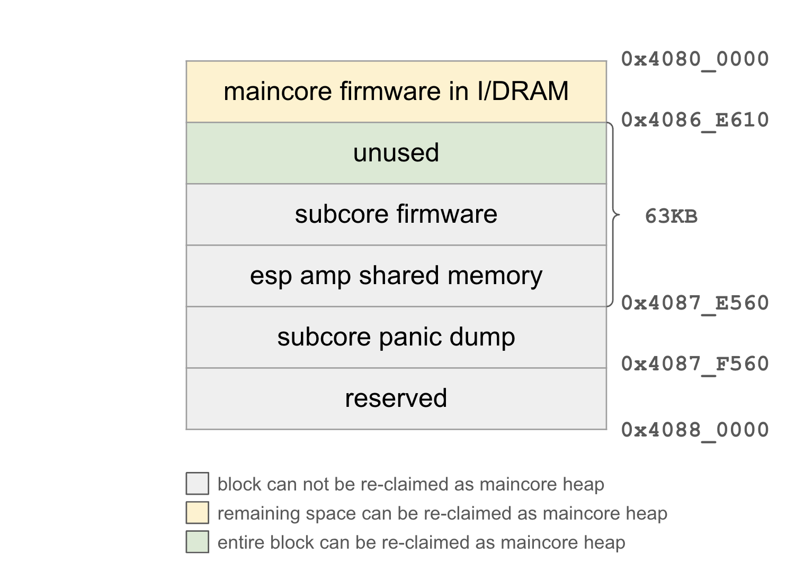
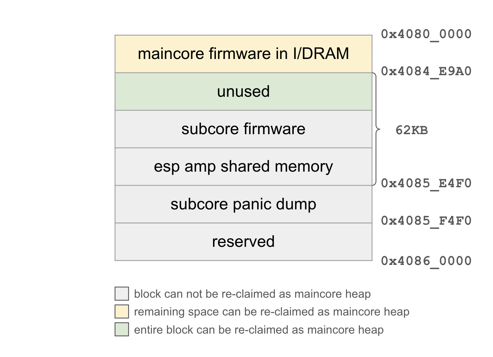
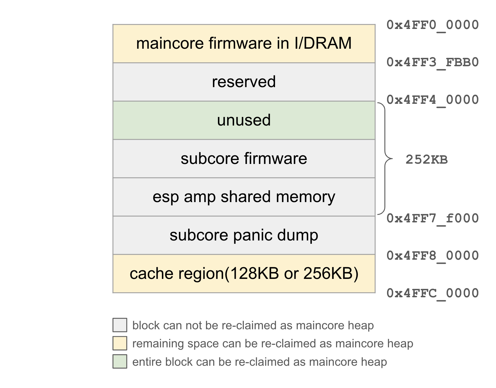

# Memory Layout of HP RAM

This document describes the memory layout of HP RAM of targets running ESP-AMP.

## Overview

Both maincore and subcore have access to the entire HP RAM. To prevent private memory regions of one core from being tampered with by another core, we must clearly define distinct memory areas for each core to use. In ESP-AMP, the following memory regions are needed: a maincore firmware region to load maincore firmware, a shared memory region for cross-core communication, and a subcore firmware region to load subcore firmware, and a panic dump region to dump subcore stack and registers.

## Design

### Memory Layout

The following diagram demonstrates the memory layout of ESP32-C6 HP RAM with LP subcore firmware loaded into HP RAM. A total size of 63KB memory space can be used for subcore firmware and shared memory. Memory is allocated from 0x4087_F560 downwards, with the highest 4KB reserved for subcore panic dump. After subcore firmware is loaded, the remaining space will be given back to maincore heap.

The memory layout of ESP32-C5 is similar to ESP32-C6, except that ESP32-C5 has a smaller HP RAM size, as shown in the following diagram.

The configurable cache size of ESP32-P4 leads to a different memory layout. In normal IDF projects, ESP32-P4 cache can be configured as 128KB (0x4FFA_0000 ~ 0x4FFC_0000), 256KB (0x4FF8_0000 ~ 0x4FFC_0000) or 512KB (0x4FF4_0000 ~ 0x4FFC_0000). In ESP-AMP, only the first two options are supported. The remaining 256KB HP RAM (0x4FF4_0000 ~ 0x4FF8_0000) is reserved for subcore firmware, shared memory and panic dump region. Address space is allocated from 0x4FF8_0000 downwards, and the remaining space will be given back to maincore heap.

The following diagram shows the memory layout of ESP32-P4 HP RAM with HP subcore firmware loaded into HP RAM.

### Shared Memory Region

Shared memory is allocated from HP MEM. Although RTC RAM (LP MEM) is also accessible by both HP core and LP core, atomic operation is not supported by RTC RAM. Consistency of shared memory cannot be guaranteed in this case.

Since AMP component allocate their data from shared memory, especially for queue component which needs considerable size of shared memory as ring buffer, it is recommended to reserve sufficient amount of shared memory.

### Subcore Firmware Region

If subcore is LP core, subcore firmware can be loaded entirely into RTC RAM. However, the 16KB size of RTC RAM can quickly go short as LP core firmware grows. Meanwhile, some features such as [deep sleep wake stubs](https://docs.espressif.com/projects/esp-idf/en/v5.3.1/esp32c6/api-guides/deep-sleep-stub.html) and [ESP Insights](https://insights.espressif.com/) also consume RTC RAM, which further limits the capability of RTC RAM to hold subcore firmware.

To solve the problem, set `CONFIG_ESP_AMP_SUBCORE_USE_HP_MEM=y` to load subcore firmware into HP RAM. Size of memory can be configured via `CONFIG_ESP_AMP_SUBCORE_USE_HP_MEM_SIZE`. For ESP32-C5 and ESP32-C6, the maximum size is 48KB. For ESP32-P4, the maximum size is 192KB.

## Usage

### How to avoid data race and ensure consistency

Proper synchronization is necessary to avoid conflicts when shared memory is accessed by maincore and subcore simultaneously. The consistency of shared memory is ensured by the following rules:

1. Allocating and writing to shared memory must be completed by maincore before subcore is booted. After subcore starts to run, maincore and subcore can only read data from SysInfo. Since there is no simultaneous read and write access to shared memory via SysInfo, the consistency of shared memory is guaranteed.
2. Event bits and software interrupt bits in shared memory are atomic integers. Any read and write access are implemented as atomic operations.
3. The synchronization of queue is guaranteed by single-writer-single-reader circular buffering. For more details, please refer to OpenAMP's [RPMsg specification](https://openamp.readthedocs.io/en/latest/protocol_details/rpmsg.html).

### Sdkconfig Options

* `CONFIG_ESP_AMP_SUBCORE_USE_HP_MEM`: If subcore firmware cannot fit into RTCRAM, part of HP RAM can be reserved for subcore to load and run its firmware in HP RAM.
* `CONFIG_ESP_AMP_SUBCORE_USE_HP_MEM_SIZE`: This specifies the size of HP RAM used for subcore firmware.
* `CONFIG_ESP_AMP_SUBCORE_STACK_SIZE_MIN`: This specifies the minimum stack size of subcore. Stack is allocated from RTC RAM on ESP32-C5 and ESP32-C6, and HP RAM on ESP32-P4. If the remaining RAM is insufficient for subcore stack, build will fail. The actual size of stack can be larger than this value if the subcore type is LP core. The entire unused RTC RAM is allocated for subcore stack.
* `ESP_AMP_SUBCORE_ENABLE_HEAP`: Enable heap for subcore.
* `CONFIG_ESP_AMP_SUBCORE_HEAP_SIZE`: This specifies the size of heap for subcore.

## Application Examples

* [subcore_use_hp_ram](../examples/subcore_use_hp_ram): demonstrates how to load subcore firmware into HP RAM.
