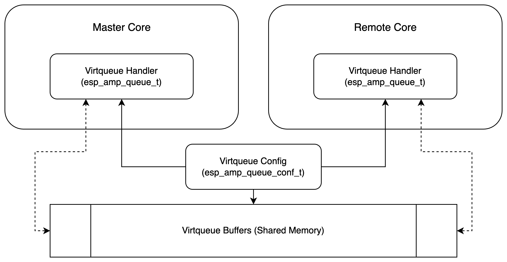
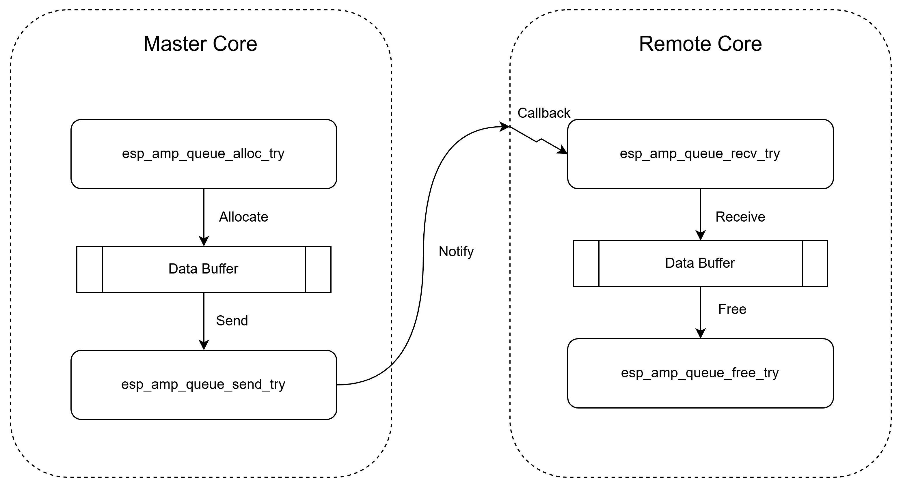

# Virtqueue (Link Layer)

## Overview

Virtqueue serves as the foundation of the RPMsg framework, providing core-to-core communication and data exchange capabilities. It is first developed for VirtIO, enables efficient communication between cores through a specialized data structure called Vring. This design eliminates the need for inter-core synchronization mechanisms like mutexes or atomic instructions, thus improving performance.

**Note**: Virtqueue implementation in ESP-AMP does not completely follow [VirtIO/Virtqueue specification](https://docs.oasis-open.org/virtio/virtio/v1.2/csd01/virtio-v1.2-csd01.html). It is designed to be lightweight and simple, with a focus on providing a basic communication channel between two cores.

## Design

### Vring

A Vring is a low-level data structure representing a circular buffer in shared memory, typically used by a Virtqueue to facilitate communication between two entities. It is composed of three basic parts: a fixed-size buffer descriptor table, an available ring (indicating buffers ready for processing), and a used ring (indicating processed buffers). Vring stores only necessary information for tracing and controlling actual buffers, thus having a low performance overhead and memory footprint. Briefly speaking, **buffer descriptor pool** records all **pointers** to actual data buffers, while **available(input) ring buffer** and **used(free) ring buffer** indicate which of them are available/used.

### Virtqueue

Virtqueues come in two variants: Split Virtqueue and Packed Virtqueue.Split Virtqueue is the original implementation and is widely adopted by frameworks like VirtIO and OpenAMP. Introduced in 2018, Packed Virtqueue offers improved performance and a smaller footprint compared to the classical Split Virtqueue. In ESP-AMP, only Packed Virtqueue is supported.

The data structure of an ESP-AMP queue is as follows:



### Master and Remote Core

The two entities linked by virtqueue are `master core` and `remote core`. `Master core` is responsible for actively sending messages, while `remote core` reads and processes these messages. After processing, `remote core` frees the message buffer, allowing it to be reused by the `master core` in future operations. Don’t be misled by the name `master core` and assume that it must be the maincore. Both maincore and subcore can be either `master core` or `remote core` when communicating using a single Virtqueue.

### Data Transmission

The two entities linked by Virtqueue are `master core` and `remote core`. `master core` can "recycle" `used(free)` buffers, read/write to them, and then mark them as `available`. Once the buffer is marked as `available`, `remote core` can read/write. Similarly, after "consuming" the `available` buffer, `remote core` can mark it as `used(free)` again, which allows `master core` to "recycle" it again.

The figure below illustrates a single round of data transmission from `master core` to `remote core` using Virtqueue, outlining each step of the process.



1. `master core` reserves one `available` buffer entry internally from the current Virtqueue by calling `esp_amp_queue_alloc_try()`. Once the API returns a valid pointer, read/write to the buffer can be performed in place, which can be then sent to the `remote core` later.

2. `master core` marks the previously reserved `available` buffer entry as `used(free)` by calling `esp_amp_queue_send_try()`. From now on, this buffer has been sent to the `remote core` and **can not** be read/written by `master core` anymore.

3. `remote core` reserves one `used(free)` buffer entry internally from the current Virtqueue by calling `esp_amp_queue_recv_try()`. Once the API returns a valid pointer, read/write to the buffer can be performed in place, which can be then sent back to the `master core` later.

4. `remote core` marks the previously reserved `used(free)` buffer entry as `available` by calling `esp_amp_queue_free_try()`. From now on, this buffer has been sent back to the `master core` and **can not** be read/written by `remote core` anymore.

## Usage

The usage of APIs is exactly the same between maincore and subcore.

### Initialization

The following two APIs can be used for queue initialization on maincore and subcore. Note, both maincore and subcore can be either `master core` or `remote core`.

The argument `uint16_t queue_len` must be power of 2. If not, it will be rounded up to the nearest power of 2 internally. If `is_master` is true, `esp_amp_queue_cb_t cb_func` serves as the **notify function**, which will be automatically invoked after successfully sending data; otherwise, it serves as the **callback function**, which will be automatically invoked when receiving new data.

```c
/* on maincore */
int esp_amp_queue_main_init(esp_amp_queue_t* queue, uint16_t queue_len, uint16_t queue_item_size, esp_amp_queue_cb_t cb_func, void* priv_data, bool is_master, esp_amp_sys_info_id_t sysinfo_id);

/* on subcore */
int esp_amp_queue_sub_init(esp_amp_queue_t* queue, esp_amp_queue_cb_t cb_func, void* priv_data, bool is_master, esp_amp_sys_info_id_t sysinfo_id);
```

### Callback and Notify

**callback function** can be either invoked by manual polling or being triggered automatically under ISR context. **notify function** will be automatically called whenever `esp_amp_queue_send_try` is invoked and successful.

when performing the initialization, `esp_amp_queue_cb_t cb_func` serves both as **callback function** and **notify function**, which depends on the value of `is_master`.

Here is the definition of function pointer type for both **callback function** and **notify function**:

```c
typedef int (*esp_amp_queue_cb_t)(void*);
```

Basically, **callback function** is responsible for receiving and processing new data from the other side, while **notify function** is responsible for notifying the other side when successfully sending the data item.

### Interrupt

If interrupt-based mechanism is prefered, the following APIs can be used to enable/disable interrupt on the remote core.

``` c
int esp_amp_queue_intr_enable(esp_amp_queue_t* queue, esp_amp_sw_intr_id_t sw_intr_id);
```

To trigger the interrupt on the remote core, define the following callback on the master core:

```c
int notify_func(void* args)
{
    /* make sure sw_intr_id matches the one defined on the remote core */
    esp_amp_sw_intr_trigger(sw_intr_id);
    return 0;
}
```

### Send and Receive

There are mainly 4 APIs used to send/receive the data through the virtqueue:

```c
int esp_amp_queue_alloc_try(esp_amp_queue_t *queue, void** buffer, uint16_t size);
```

`master core` only, allocate a data buffer which can be sent later

```c
int esp_amp_queue_send_try(esp_amp_queue_t *queue, void* buffer, uint16_t size);
```

`master core` only, send an allocated data buffer to the `remote core`

```c
int esp_amp_queue_recv_try(esp_amp_queue_t *queue, void** buffer, uint16_t* size);
```

`remote core` only, receive a data buffer from `master core`

```c
int esp_amp_queue_free_try(esp_amp_queue_t *queue, void* buffer);
```

`remote core` only, free the data buffer received from `master core`

**Warning**: invoke `esp_amp_queue_send_try` or `esp_amp_queue_free_try` to send a buffer which doesn't come from `esp_amp_queue_alloc_try` or `esp_amp_queue_recv_try` will lead to UNDEFINED BEHAVIOR

**Warning**: `esp_amp_queue_send_try` and `esp_amp_queue_free_try` MUST BE invoked in pair, as well as `esp_amp_queue_recv_try` and `esp_amp_queue_free_try`. Otherwise, some buffer entries in the Virtqueue can never be used again

### Mutual Exclusion

The proper functioning of Virtqueue relies on the assumption that there is a single `master core` acting as the producer and a single `remote core` acting as the consumer. We strongly recommend using RPMsg APIs instead of directly interacting with Virtqueue. However, if you choose to use Virtqueue, you must ensure mutual exclusion to prevent potential concurrent access from both task and ISR contexts.

## Application Examples

* [virtqueue](../examples/virtqueue): demonstrates how to send data from subcore (master core) to maincore (remote core) using virtqueue.
