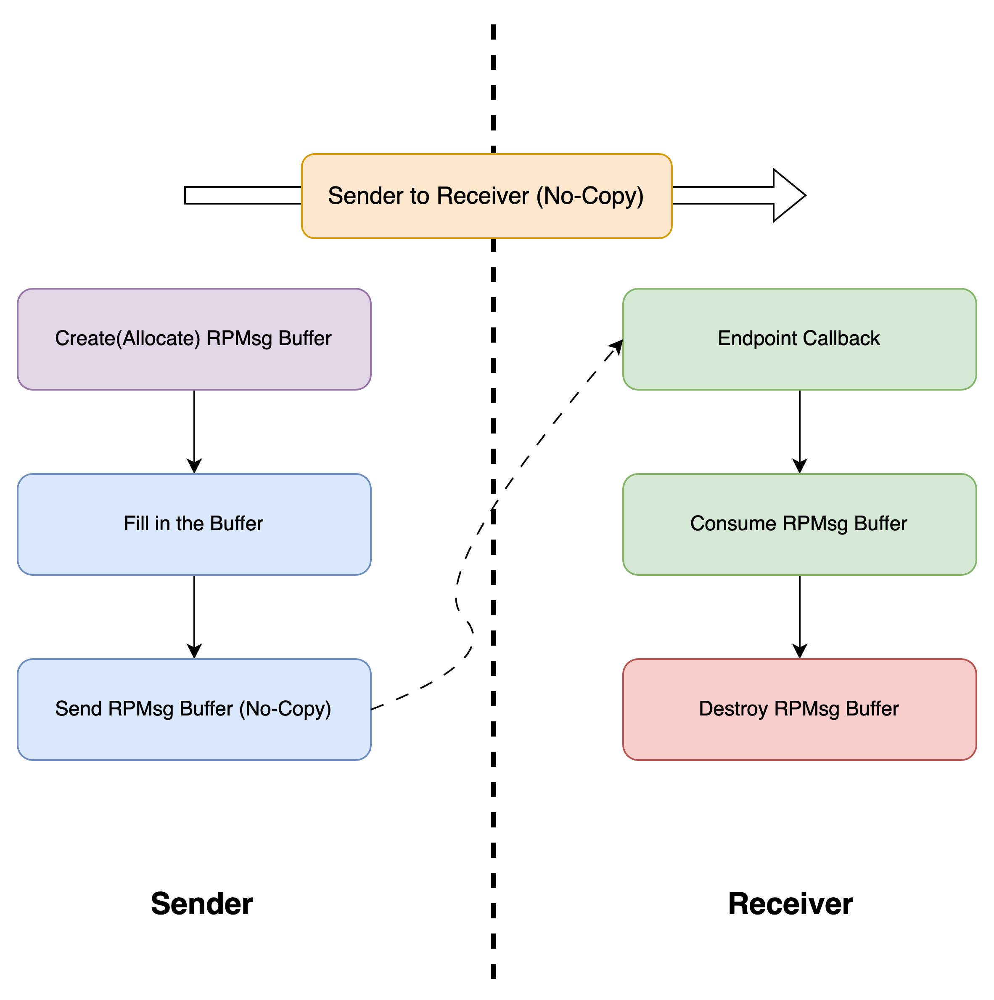
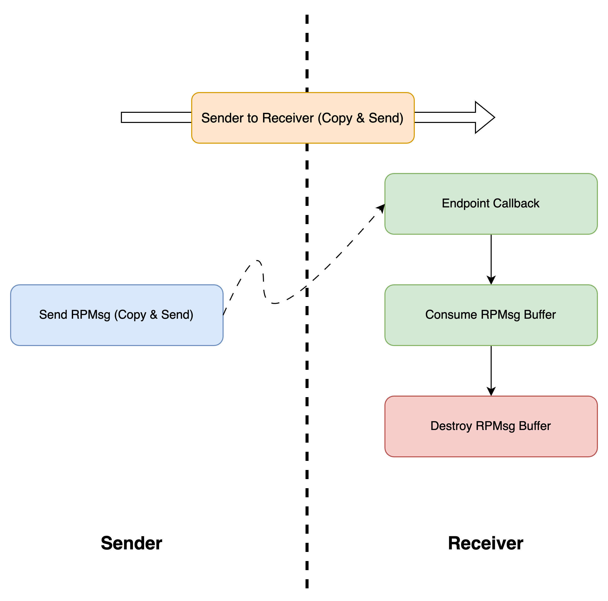

# RPMsg (Transport Layer)

## Overview

This layer provides **bidirectional end-to-end** communication and data exchange support in the framework. It features high efficiency and low memory footprint, which is able to multiplex the queue layer for various upper-level applications.

The RPMsg (Remote Processor Messaging) protocol is a critical component in modern embedded systems, particularly in multi-processor or multi-core architectures. It facilitates efficient inter-processor communication (IPC) by providing a standardized, low-overhead mechanism for message exchange between processors.

ESP-AMP's RPMsg implementation provides a communication framework supporting both FreeRTOS and bare-metal environments, which can be used to exchange data easily and efficiently between different cores.

## Design

One or more ESP-AMP RPMsg devices can be created on one core and communicate with its remote peer on another core. This core-to-core bidirectional communication relies on two virtqueues acting as TX and RX channels respectively. Multiple endpoints are allowed to create on top of each RPMsg devices, and any two endpoints across cores can pair into source and destination endpoints for data exchange. Endpoints share the same underlying virtqueues with other endpoints to communicate with their destinations on remote core, effectively multiplexing the virtqueues.

### Concept of Endpoint

Recall that in `TCP/IP`, multiple clients and servers can bind to different `port` number on one device and communicate with their destinations on another device. A linked pair of client and server form a pair of source and destination endpoints. Each endpoint is defined by a combination of an IP address and a port number. When a device receives an incoming packet from a source endpoint on the remote device, it will dispatch the packet to the corresponding destination endpoint based on the destined `port` number specified in the packet header.

Similar to `TCP/IP` communication, RPMsg also has concepts of device (processor) and endpoint (endpoint id). When an RPMsg source endpoint sends data from the local core to its destination endpoint on the remote core, the destined endpoint id must be specified to ensure that the message will go into the other core's corresponding endpoint and processed by its callback function.

### Workflow and Data Sending

#### 1. Send data without copy

Thanks to the nature of shared memory, sending data using rpmsg without copy is possible and recommended. To achieve this, `esp_amp_rpmsg_create_message()` should be firstly called by the **sender**, which will reserve one rpmsg buffer internally and return its pointer. After successfully getting the buffer pointer, in-place read/write can be performed. When everything is done, `esp_amp_rpmsg_send_nocopy()` can be invoked to send this exact rpmsg buffer to the other side. Note, these two APIs should always be called in pair. Otherwise, undefined behavior or buffer leak (similar to memory leak) can happen. The procedure is shown as the following figure:



For more details about corresponding APIs, please refer to the **Usage** section

#### 2. Send data with copy

Under some circumstances, copying and sending data in one function call is preferred. In this case, just invoke `esp_amp_rpmsg_send()` with data to be sent is enough. In other words, `esp_amp_rpmsg_send()` should be used standalone, WITHOUT calling `esp_amp_rpmsg_create_message()`. Otherwise, buffer leak(similar to memory leak) can happen. The procedure is shown as the following figure:



For more details about corresponding APIs, please refer to the **Usage** section

## Usage

The usage of APIs is nearly the same between main-core and sub-core.

### Initialization

Before using the rpmsg framework APIs, initialization must be performed first. A data structure `esp_amp_rpmsg_dev_t` (defined in `src/esp_amp_rpmsg.h`) must be allocated in advance per side, whether statically or dynamically. Then, on main-core, `esp_amp_rpmsg_main_init` should be called before the sub-core can invoke `esp_amp_rpmsg_sub_init`. After initialization is done on both side, all rpmsg framework APIs can be used.

```c
/* Invoked on Main-Core */
int esp_amp_rpmsg_main_init(esp_amp_rpmsg_dev_t* rpmsg_dev, uint16_t queue_len, uint16_t queue_item_size, bool notify, bool poll);

/* Invoked on Sub-Core*/
int esp_amp_rpmsg_sub_init(esp_amp_rpmsg_dev_t* rpmsg_dev, bool notify, bool poll);
```

In most cases, you only need one pair of rpmsg device for inter-processor communication, since multiple endpoints can be created on a single rpmsg device. If more than one pair of rpmsg device is needed, use the following APIs to specify different `sysinfo_id` for each pair of rpmsg device.

``` c
/* Invoked on Main-Core */
int esp_amp_rpmsg_main_init_by_id(esp_amp_rpmsg_dev_t* rpmsg_dev, esp_amp_queue_t rpmsg_vqueue[], uint16_t queue_len, uint16_t queue_item_size, bool notify, bool poll, esp_amp_sys_info_id_t sysinfo_id);

/* Invoked on Sub-Core*/
int esp_amp_rpmsg_sub_init_by_id(esp_amp_rpmsg_dev_t* rpmsg_dev, esp_amp_queue_t rpmsg_vqueue[], bool notify, bool poll, esp_amp_sys_info_id_t sysinfo_id);
```

If you set `poll` to `false`(which means interrupt mechanism will be used on the setting core), the `notify` parameter MUST BE set to `true` **on the other core**, vice versa.

Besides, `esp_amp_rpmsg_intr_enable` **SHOULD BE** manually invoked after initialization on the core where interrupt mechanism is used.

### Endpoint Creation and Deletion

Endpoint can be dynamically created/deleted/rebound on the specific core.

```c
esp_amp_rpmsg_ept_t* esp_amp_rpmsg_create_endpoint(esp_amp_rpmsg_dev_t* rpmsg_device, uint16_t ept_addr, esp_amp_ept_cb_t ept_rx_cb, void* ept_rx_cb_data, esp_amp_rpmsg_ept_t* ept_ctx);
```

Create an endpoint with specific `ept_addr` and callback function(`ept_rx_cb`). `ept_rx_cb_data` will be passed to the callback function every time the function is invoked. `ept_ctx` is a pointer pointing to the pre-allocated buffer to store the endpoint data structure. It must be statically or dynamically allocated before this API is called. Return value is the same pointer as `ept_ctx` if successful. Otherwise, `NULL` will be returned.

```c
int (*esp_amp_ept_cb_t)(void* msg_data, uint16_t data_len, uint16_t src_addr, void* rx_cb_data)
```

Prototype of callback function `ept_rx_cb_data`, where `msg_data` is a pointer pointing to the rpmsg buffer which contains the received message. `data_len` is the length of the message. `src_addr` is the endpoint address of the sender. `rx_cb_data` is a data pointer saved in endpoint's data structure which can provide extra data/information in case it is necessary, and will be passed to the callback function every time the function is invoked.

**Note**: the endpoint's callback function runs in `ISR context` if inter-core interrupts configured by ESP-AMP framework are enabled for `rpmsg` on the specific core. Consequently, only those ISR-safe APIs can be invoked inside the callback function, and any blocking or time-consuming things should be avoided.

```c
esp_amp_rpmsg_ept_t* esp_amp_rpmsg_del_endpoint(esp_amp_rpmsg_dev_t* rpmsg_device, uint16_t ept_addr);
```

Delete an endpoint with specific address. This API will return `NULL` if the endpoint with corresponding `ept_addr` doesn't exist. If successful, the pointer to the deleted endpoint data structure will be returned, which can be freed or re-used later.

```c
esp_amp_rpmsg_ept_t* esp_amp_rpmsg_rebind_endpoint(esp_amp_rpmsg_dev_t* rpmsg_device, uint16_t ept_addr, esp_amp_ept_cb_t ept_rx_cb, void* ept_rx_cb_data);
```

Rebind an existing endpoint(specified using `ept_addr`) to different callback function(`ept_rx_cb`) and `ept_rx_cb_data`. This API will return `NULL` if the endpoint with corresponding `ept_addr` doesn't exist. If successful, the pointer to the modified endpoint data structure will be returned.

```c
esp_amp_rpmsg_ept_t* esp_amp_rpmsg_search_endpoint(esp_amp_rpmsg_dev_t* rpmsg_device, uint16_t ept_addr);
```

Search for an endpoint specified with `ept_addr`. This API will return `NULL` if the endpoint with corresponding `ept_addr` doesn't exist. If successful, the pointer to the endpoint will be returned.

### Send Data

#### 1. Send Data Without Copy

To achieve this, the following API should be firstly called by the **sender**, which will reserve one rpmsg buffer internally and return its pointer:

```c
void* esp_amp_rpmsg_create_message(esp_amp_rpmsg_dev_t* rpmsg_dev, uint32_t nbytes, uint16_t flags);
```

After successfully getting the buffer pointer, in-place read/write can be performed. When everything is done, the following API should be invoked to send this rpmsg buffer to the other side:

```c
int esp_amp_rpmsg_send_nocopy(esp_amp_rpmsg_dev_t* rpmsg_dev, esp_amp_rpmsg_ept_t* ept, uint16_t dst_addr, void* data, uint16_t data_len);
```

The procedure is shown in the **Design** section.

#### 2. Send Data With Copy

In this case, just invoke the following API with data to be sent is enough:

```c
int esp_amp_rpmsg_send(esp_amp_rpmsg_dev_t* rpmsg_dev, esp_amp_rpmsg_ept_t* ept, uint16_t dst_addr, void* data, uint16_t data_len);
```

Note, `esp_amp_rpmsg_send()` should be used standalone, WITHOUT calling `esp_amp_rpmsg_create_message()`. Otherwise, buffer leak(similar to memory leak) can happen. The procedure is shown in the **Design** section.

### Receive and consume data

The corresponding endpoint's callback function on the receiver side will be automatically invoked(by polling or interrupt handler) when the sender successfully sends the rpmsg. A pointer to the rpmsg data buffer will be provided to the callback function for reading/writing data. After finishing using the data buffer completely, the following API **MUST BE** called on this rpmsg buffer. Otherwise, buffer leak(similar to memory leak) can happen:

```c
int esp_amp_rpmsg_destroy(esp_amp_rpmsg_dev_t* rpmsg_dev, void* msg_data);
```

**Note**: `esp_amp_rpmsg_destroy()` MUST BE called on the receiver side after completely finishing using. Invoking this API on sender side or accessing the destroyed buffer can lead to UNDEFINED BEHAVIOR!

### Deal with Buffer Overflow

The buffer overflow will happen whenever the size of data to be sent(including rpmsg header) is larger than the `queue_item_size` when performing the initialization. When this happens, `esp_amp_rpmsg_create_message()` will return `NULL` pointer (i.e. refuse to allocate the rpmsg buffer whose size is expected to be larger than the maximum settings), `esp_amp_rpmsg_send_nocopy()` will return `-1` (i.e. refuse to send this rpmsg), `esp_amp_rpmsg_send()` will return `-1` (i.e. refuse to copy and send this rpmsg). In such case, the user should manage to split the data into several smaller pieces(packets) and then send them one by one. 

**Note**: User should ensure either BOTH of or NONE of `esp_amp_rpmsg_create_message()` and `esp_amp_rpmsg_send_nocopy()` succeed. Otherwise, buffer leak(similar to memory leak) can happen. To achieve this, there are mainly three approaches: 1. make the size allocating (creating) the rpmsg larger or equal to the size sending the data; 2. re-send a special small message using the same rpmsg buffer which can be identified by the other side when `esp_amp_rpmsg_create_message()` succeeds while `esp_amp_rpmsg_send_nocopy()` fails; 3. use `esp_amp_rpmsg_send()`

## Application Examples

* [rpmsg_send_recv](../examples/rpmsg_send_recv/): demonstrates how maincore and subcore send data to each other using rpmsg.
