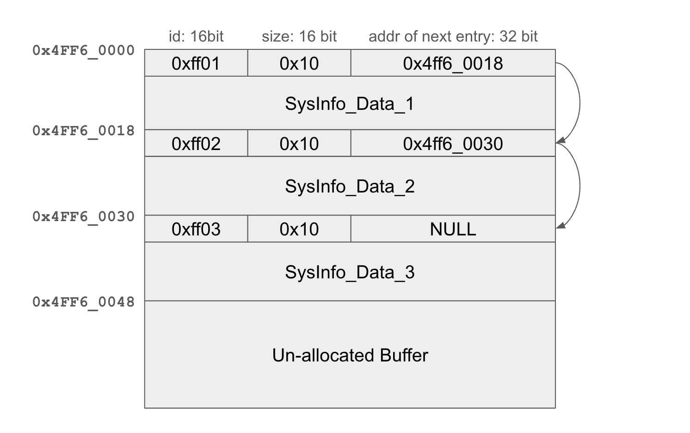

# Shared Memory & SysInfo

This document covers the concept of shared memory, why it is important and how to use SysInfo to manage shared memory in your applications.

## Overview

Shared memory refers to the memory region which is accessible by both maincore and subcore. In ESP-AMP, shared memory is the fundamental building block of cross-core communication and synchronization between maincore and subcore.

To centralize the management of shared memory, ESP-AMP introduces SysInfo to keep track of allocated shared memory blocks. Maincore can allocate a block of shared memory via SysInfo, initialize the content, and assign a unique id to this block. Subcore applications can get the content of shared memory blocks by querying SysInfo.

## Design

### SysInfo Structure

SysInfo consists of a list of entries that keep track of each allocated memory block. Each entry is a triple with 16-bit ID, 16-bit size, and 32-bit address. The maximum number of entries can be configured via sdkconfig. The structure of SysInfo is shown below.



There is no API to free SysInfo in ESP-AMP. Once an entry of SysInfo is allocated, it will be kept in the system until the system is reset.

## Usage

SysInfo IDs are unsigned short integers range from `0x0000` to `0xffff`. The upper half (`0xff00` ~ `0xffff`) is reserved for ESP-AMP internal use. Lower half is free to use in user application. 

By default, SysInfo supports up to 16 entries. At present, ESP-AMP internally takes 6 entries which are:

``` shell
    SYS_INFO_RESERVED_ID_SW_INTR = 0xff00, /* reserved for software interrupt */
    SYS_INFO_ID_EVENT = 0xff01, /* reserved for event */
    SYS_INFO_ID_SHARED_MEM = 0xff02, /* reserved for shared memory */
    SYS_INFO_ID_VQUEUE_TX = 0xff03,  /* reserved for virtqueue  */
    SYS_INFO_ID_VQUEUE_RX = 0xff04,  /* reserved for virtqueue */
    SYS_INFO_ID_VQUEUE_BUFFER = 0xff05, /* reserved for virtqueue */
```

### Maincore

Maincore application can allocate a block of shared memory via SysInfo. The following code snippet shows how to allocate a block of shared memory and initialize the content to indicate a person's name and age.

``` c
typedef struct {
    char[16] name;
    uint32_t age;
} Person_t;

Person_t *person = (Person_t *) esp_amp_sys_info_alloc(SYS_INFO_ID_PERSON_1, sizeof(Person_t));
if (person == NULL) {
    return -1;
}
```

### Subcore

Subcore application can get the content of shared memory blocks by querying SysInfo. The following code snippet shows how to get the content of a shared memory block set by maincore.

``` c

typedef struct {
    char[16] name;
    uint32_t age;
} Person_t;

Person_t *person = (Person_t *) esp_amp_sys_info_get(SYS_INFO_ID_PERSON_1, NULL);
if (person == NULL) {
    return -1;
}

printf("Person name: %s\n", person->name);
printf("Person age: %d\n", person->age);

```

### Sdkconfig Options

* `CONFIG_ESP_AMP_SHARED_MEM_LOC`: Location of shared memory. At present only DRAM (HP RAM) is supported (`CONFIG_ESP_AMP_SHARED_MEM_IN_HP=y`). Due to the fact that RTCRAM does not support atomic operation such as Compare-and-Swap (CAS) as well as memory barrier, which is necessary for ESP-AMP, allocating shared memory from RTCRAM is disallowed in ESP-AMP.
* `CONFIG_ESP_AMP_SHARED_MEM_SIZE`: Size of shared memory.
