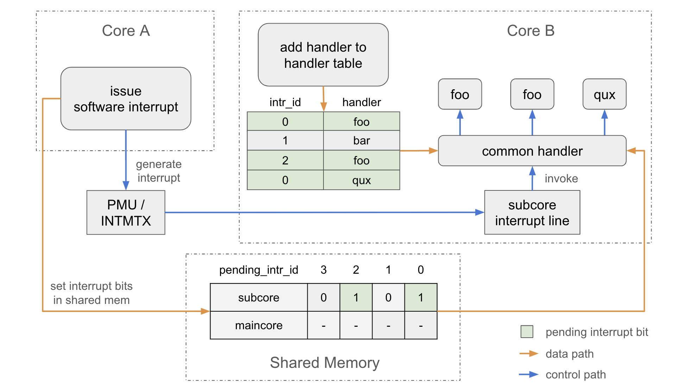

# Software Interrupt

This document covers the concept of software interrupt, why it is important as well as how to use software interrupt in ESP-AMP.

## Overview

Different from hardware interrupts generated by peripheral controllers, software interrupts are generated by software. In ESP-AMP, software interrupt mainly refers to the inter-processor interrupt (IPI) between maincore and subcore. It can be used to trigger inter-processor call (IPC) on maincore from subcore and vice versa. Queue component relies on software interrupts to notify the arrival of new messages and trigger the processing of messages on the receiving core. Users are free to define their own interrupt sources and handlers, to achieve async IPC.

## Design

ESP-AMP relies on different underlying hardware to generate software interrupt. Power Management Unit (PMU) is chosen in AMP systems with LP core as subcore. Interrupt Matrix (INTMTX) is used in AMP system where maincore and subcore are both HP cores. A single interrupt line is shared by all software interrupt sources. A common handler is registered to serve this interrupt line and dispatches software interrupts to their user-registered handlers.

The following diagram shows the workflow of software interrupt. In this example, core A issues software interrupt source 0 and 2 to core B. Core B registers `qux` as handler of interrupt source 0, `bar` as handler of interrupt source 1, and `foo` as handler of both interrupt source 0 and 2.



When a software interrupt generated on core A arrives core B via PMU or INTMTX, core B jumps to the common handler of software interrupt. It traverses the interrupt handler table to invoke all the handlers registered for any of the pending interrupt sources one by one. After all corresponding handlers are invoked, the pending interrupt sources are cleared. In this example, since core A triggred interrupt source 0 and 2 to core B, software interrupt common handler of core B first invoke `foo` to handle interrupt source 0, followed by `foo` again serving interrupt source 2 and `qux` for interrupt source 0.

This design facilitates the library development by decoupling interrupt handlers from their sources. Imagine that multiple libraries listen to a common software interrupt. Normally they will need to construct a common handler first and bind the monolithic handler to the interrupt source. With interrupt handler table, they can register their own interrupt handlers separately to the global interrupt handler table. Dispatching interrupt sources to corresponding handlers is taken care by the common handler.

However, time spent in ISR context handling software interrupt increases as the interrupt handler table grows. The default length of interrupt handler table is 8 and can be configured via `CONFIG_ESP_AMP_SW_INTR_HANDLER_TABLE_LEN`. Note that this length means the number of handlers can be registered, instead of the number of interrupt sources can be served. All `CONFIG_ESP_AMP_SW_INTR_HANDLER_TABLE_LEN` handlers can be registered to serve a single interrupt.

## Usage

ESP-AMP allows up to 32 software interrupt sources. Pending interrupt sources are reflected by a pair of atomic integers in shared memory. Registered interrupt handlers are added to a software interrupt handler table, where each entry is a key-value pair, with the key being the interrupt source ID and value being the interrupt handler.

Users can register multiple software interrupt handlers to a single common interrupt, or register a single common software interrupt handler to handle multiple interrupts.

Software interrupt APIs are common across maincore and subcore. To register a software interrupt handler, call `esp_amp_sw_intr_add_handler()` with the interrupt source ID and the interrupt handler. To unregister a software interrupt handler, call `esp_amp_sw_intr_delete_handler()` with the interrupt source ID and the interrupt handler. To trigger a software interrupt, call `esp_amp_sw_intr_trigger()` with the interrupt source ID. To dump the software interrupt handler table, call `esp_amp_sw_intr_handler_dump()`.


### Maincore

The following example demonstrates how to register and unregister a software interrupt handler on maincore (IDF FreeRTOS environment).

``` c
static const DRAM_ATTR char TAG[] = "test_sw_intr";

// software interrupt handler to be registered
static IRAM_ATTR int sw_intr_id0_handler_1(void *arg)
{
    (void)arg;
    ESP_DRAM_LOGI(TAG, "sw_intr_id0_handler_1() called");
    return 0;
}

// register sw_intr_id0_handler_1 to interrupt source 0
esp_amp_sw_intr_add_handler(SW_INTR_ID_0, sw_intr_id0_handler_1, NULL);

// unregister sw_intr_id0_handler_1 from interrupt source 0
esp_amp_sw_intr_delete_handler(SW_INTR_ID_0, sw_intr_id0_handler_1, NULL);
```

In maincore applications, as normal IDF interrupt handlers, [`IRAM_ATTR`](https://docs.espressif.com/projects/esp-idf/en/stable/esp32/api-guides/memory-types.html#how-to-place-code-in-iram) is needed to enforce the interrupt handler loaded into internal RAM. [`ESP_DRAM_LOGx`](https://docs.espressif.com/projects/esp-idf/en/stable/esp32/api-reference/system/log.html) is recommended for logging in the interrupt handler.

Tasks with higher priority can be woken within the processing of software interrupt. The return value of software interrupt handlers should indicate whether a context switch is needed. Before exiting from ISR, common interrupt handler will call `portYield_from_ISR(need_yield)` to guarantee the interrupt always returns to the task in RUNNING state. It collects the return values of all software interrupt handlers and perform the logical OR operation. It is recommended to implement software interrupt handler in the following way:

``` c
static int usr_sw_intr_isr(void *args)
{
    (void) args;
    uint32_t unprocessed = 0;
    BaseType_t need_yield = 0;

    xEventGroupSetBitsFromISR(s_event_group, unprocessed, &need_yield);
    return need_yield;
}
```

### Subcore

Subcore applications can register and unregister software interrupt handlers in the same way as maincore applications. There is no difference in APIs between FreeRTOS and bare-metal environment. 

`IRAM_ATTR` is not needed in subcore applications since the entire subcore firmware is loaded into internal RAM. Meanwhile, printf can be used for logging in software interrupt handlers.

Unlike the return value of a software interrupt handler in maincore application that indicates a necessary context switch, return value in subcore applications is ignored. 

### Sdkconfig Options

* `CONFIG_ESP_AMP_SW_INTR_HANDLER_TABLE_LEN`: By default, up to 8 software interrupt handlers can be registered. Increase this will allow more handlers but introduce more latency as well.


## Application Examples

* [software_interrupt](../examples/software_interrupt): demostrates how to issue software interrupt and register software interrupt handler. Handlers can be registered to a single common interrupt or multiple interrupts.
