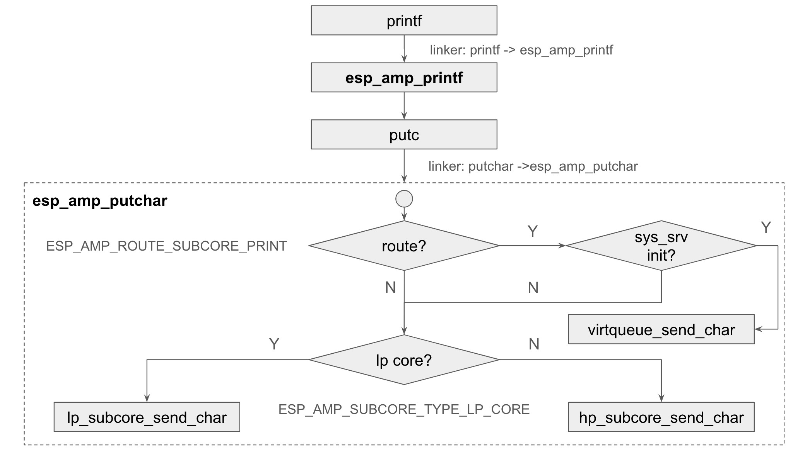

# System

## Overview

ESP-AMP System component provides APIs to manage subcore, including starting and stopping subcore, loading subcore firmware to DRAM, dealing with subcore panic, and routing subcore printf messages to maincore console.

## Design

### Subcore Supplicant

ESP-AMP system component offers an optional subcore supplicant with a single-way virtqueue for subcore to send system data to maincore. This feature introduces 2KB extra flash footprint in maincore firmware and 2.5KB heap usage. Virtqueue takes up 2KB shared memory. Due to the overhead of subcore supplicant, it is by default disabled. To enable it, set `CONFIG_ESP_AMP_ENABLE_SUPPLICANT` to `y` via menuconfig.

### Subcore Print Workflow

By default, subcore uses separate console to output printf messages: LP Subcore prints to LP UART, HP Subcore can print to UART1. Since the only usb-to-uart converter is occupied by maincore, additional hardware is needed to check subcore console output.

Although it is feasible for subcore to write log to maincore UART tx fifo, which will make subcore console output visible on maincore console, logs from both sides will be mixed together and hard to distinguish. This is due to the lack of mutual exclusion between two cores. Therefore, ESP-AMP system component employs virtqueue to route subcore printf messages to subcore supplicant on maincore side and output to maincore console. As the subcore supplicant is a normal maincore task, printing to maincore console won't be interleaved with other maincore tasks.

The old printf to output via separate UART is still available and can be enabled via Kconfig options. The following figure illustrates the workflow of subcore printf, as well as the Kconfig options to switch between different printf methods.



When `printf()` is called in subcore app, `esp_amp_printf()` is the actual function being called. It converts the format string and arguments into a plain string and calls `esp_amp_putchar()` to send the string to desired output console. Depending on two Kconfig options and one runtime variable, the actual implementation of `esp_amp_putchar()` switches among the following functions:

1. `virtqueue_send_char()`: when `CONFIG_ESP_AMP_ROUTE_SUBCORE_PRINT=y` and system service virtqueue is initialized.
2. `lp_subcore_send_char()`: when `CONFIG_ESP_AMP_ROUTE_SUBCORE_PRINT=n` and `CONFIG_ESP_AMP_SUBCORE_TYPE_LP_CORE=y`
3. `hp_subcore_send_char()`: when `CONFIG_ESP_AMP_ROUTE_SUBCORE_PRINT=n` and `CONFIG_ESP_AMP_SUBCORE_TYPE_HP_CORE=y`

We also offer a fallback API `esp_amp_early_printf()` which writes to UART tx fifo directly. When system service virtqueue is not initialized, subcore will use `esp_amp_early_printf()` to print panic message on maincore console. This ensures no message is lost, although very few message will be mixed with maincore print. Same works for subcore panic.

### Subcore Panic Handling

Apart from routing subcore printf messages, another important role of subcore supplicant is to handle subcore panic in maincore app. When subcore panics, panic handler on subcore side will dump its stack data and registers to a dedicated memory region and trigger a software interrupt to maincore. Maincore will stop the subcore and print the panic message to console aftering being notified by the software interrupt.

Examples of panic handling are printing subcore panic information, reloading subcore firmware, reseting shared memory or reseting the entire system. The default panic handler we offer simply prints subcore panic information. It is a weak function and can be overwritten by your own implementation. Note that panic handling operations can be either time-consuming (print panic information) or involving APIs not available in ISR context (memory operation), the panic handler is postponed to task context and executed by subcore supplicant. 

## Usage

### Load Subcore

For more details, please refer to [build system doc](build_system.md).

### Start & Stop Subcore

To start a subcore:

``` c
int esp_amp_start_subcore(void);
```

To stop a subcore:

``` c
void esp_amp_stop_subcore(void);
```

### Subcore Panic Handling

To check whether subcore has panicked:

``` c
bool esp_amp_subcore_panic(void);
```

To overwrite the default subcore panic handler, simply define the following function in your maincore app. You can still call the default subcore panic handler inside your own implementation to print subcore panic information:

``` c
// your own implementation of subcore panic handler
void esp_amp_subcore_panic_handler(void)
{
    printf("subcore panic\n");
    esp_amp_subcore_panic_handler_default();
}
```

### Route Subcore Console

You don't need to do anything to route subcore console. Simply call printf and the routing happens automatically.

### Kconfig Options

* `CONFIG_ESP_AMP_SYSTEM_ENABLE_SUPPLICANT`: Create a daemon task on maincore side to handle subcore panic and route subcore printf messages to subcore supplicant on maincore side.
* `ESP_AMP_ROUTE_SUBCORE_PRINT`: Route subcore printf messages to subcore supplicant on maincore side.
